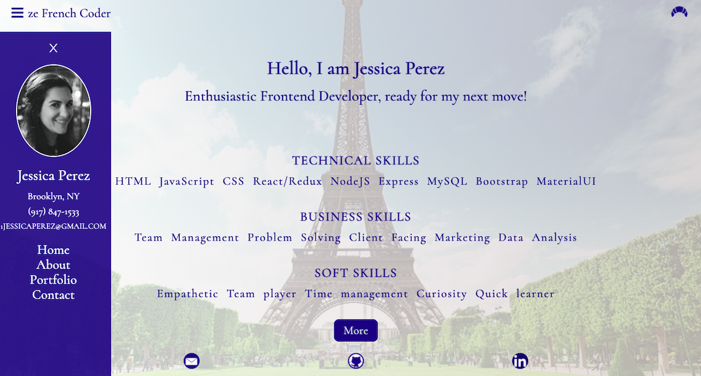
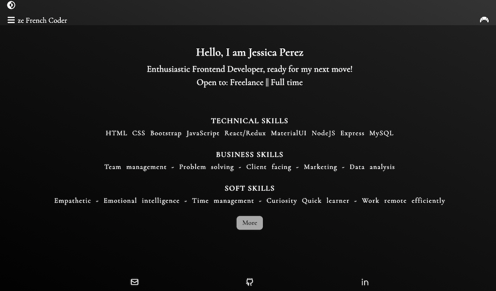

# REACT: PORTFOLIO

## Description

Created my portfolio with REACT (hooks, state, router, etc.) using some react-specific npm packages.
Ensured a responsive layout and user friendly interface with sidenav and easy navigation to links.

## Table of Contents

1. [Usage](#Usage)
2. [Github repository and Netlify deployed app link](#Github-repository-Netlify-deployed-link)
3. [Questions](#Questions)

## Usage

- Click on the deployed app link and check out my Portfolio! Please don't hesitate to get in touch.
- The user can hover over the project image and will be given the option to view the Github repository or access the app!
- Sidebar can be open/closed as needed and footer is fixed.
- Click the footer icons to easily view my GitHub, LinkedIn, or to send me an email.

### Github-repository-Netlify-deployed-link

- Github repository:
  [Github repository](https://github.com/JessicaPerez1/REACT-Portfolio.git)
- Netlify Deployed link:
  [Deployed app link](https://jessica-perez-portfolio.netlify.app/)

### Questions

For any questions about this app, please refer to my Github page or contact me by email!

- [JessicaPerez1 Github link](https://github.com/JessicaPerez1)
- 1jessicaperez@gmail.com
